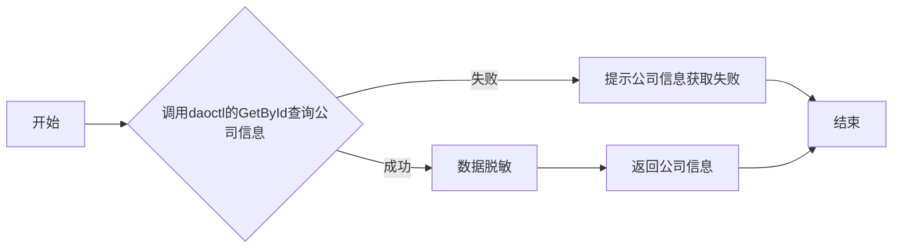

- 根据id获取公司信息

```mermaid
flowchart LR
开始 -->A[根据id查询公司信息] -->B[返回公司信息] -->结束
```

- 接口逻辑实现

```mermaid
flowchart LR
开始 -->A{调用daoctl的GetById查询公司信息}
A -->|失败| A0[提示公司信息获取失败]-->END
A -->|成功| C[数据脱敏] --> D[返回公司信息] --> END

END[结束]
```
---
备注：
- 数据脱敏: 公司负责人联系电话号码脱敏