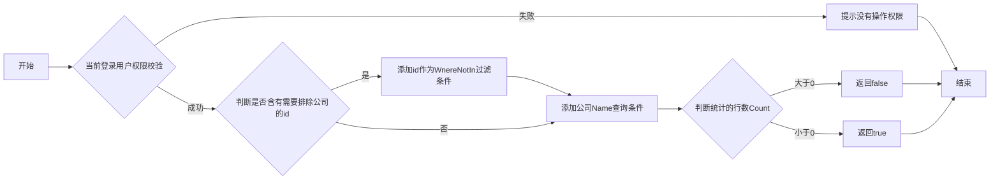

- 判断公司名称是否存在 业务流程

```mermaid
flowchart LR
开始 -->T[权限校验] -->A[添加需要排除的公司id条件] -->B[根据名称Name判断公司是否存在] -->C[返回结果] -->结束
```

- 接口逻辑实现

```mermaid
flowchart LR
开始 -->T{当前登录用户权限校验}
T -->|失败| T0[提示没有操作权限] -->END
T -->|成功| A{判断是否含有需要排除公司的id}
A -->|是| B[添加id作为WnereNotIn过滤条件]-->C[添加公司Name查询条件] -->D{判断统计的行数Count}
D -->|大于0| F[返回false] -->END
D -->|小于0| G[返回true] -->END
A -->|否| C 
END[结束]
```

