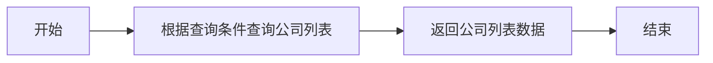
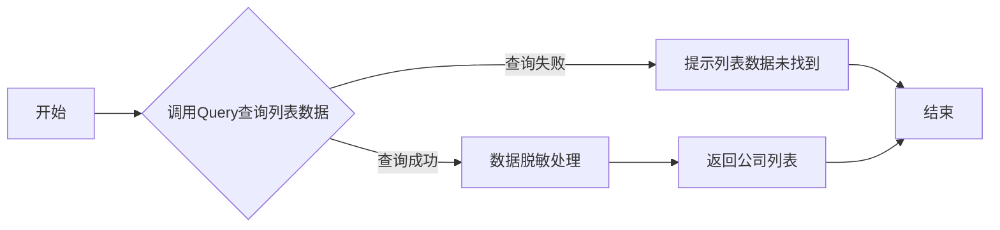

- 查询公司列表 业务流程

```mermaid 
flowchart LR
开始 -->A[根据查询条件查询公司列表] -->B[返回公司列表数据] -->结束
```

- 接口逻辑实现

```mermaid 
flowchart LR
开始 -->A{调用Query查询列表数据}
A -->|查询失败| A0[提示列表数据未找到] --> END
A -->|查询成功| B[数据脱敏处理] -->C[返回公司列表] --> END

END[结束]
```

---
备注：
- 数据脱敏: 公司负责联系人电话号码脱敏