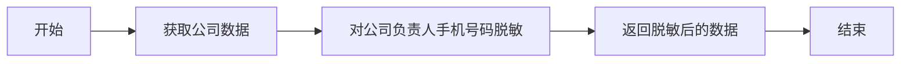
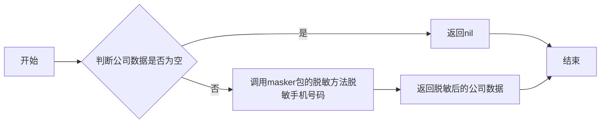

- 公司信息脱敏 业务流程

```mermaid
flowchart LR
开始 -->A[获取公司数据] -->B[对公司负责人手机号码脱敏] -->C[返回脱敏后的数据] -->结束
```
- 逻辑接口实现

```mermaid
flowchart LR
开始 -->A{判断公司数据是否为空} 
A -->|是| A0[返回nil] -->END
A -->|否| B[调用masker包的脱敏方法脱敏手机号码] -->C[返回脱敏后的公司数据] -->END
END[结束]
```