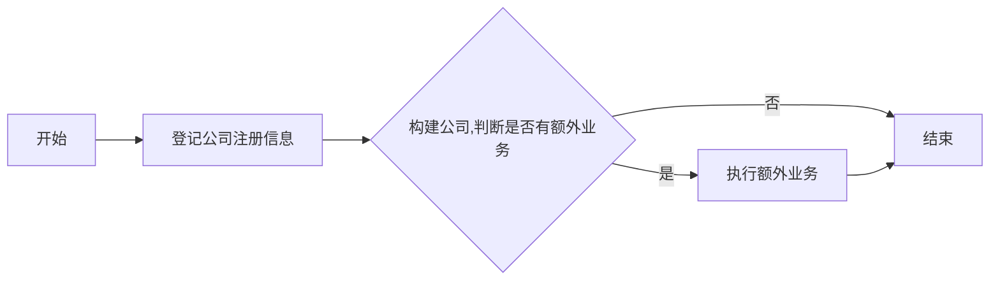
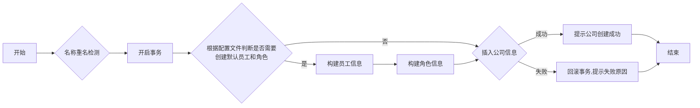

- 创建公司组织 业务流程

```mermaid 
flowchart LR
开始 -->A[登记公司注册信息] -->B{构建公司,判断是否有额外业务}
B -->|否| END
B -->|是| C[执行额外业务] -->END
END[结束]
```

- 接口逻辑实现

```mermaid 
flowchart LR
开始 -->A{名称重名检测} --> B[开启事务] -->C{根据配置文件判断是否需要创建默认员工和角色}
C -->|否| D{插入公司信息}
C -->|是| E[构建员工信息] -->F[构建角色信息] -->D
D -->|失败| FAILED
D -->|成功| D1[提示公司创建成功] --> END

END[结束]
FAILED[回滚事务,提示失败原因]--> END
```

