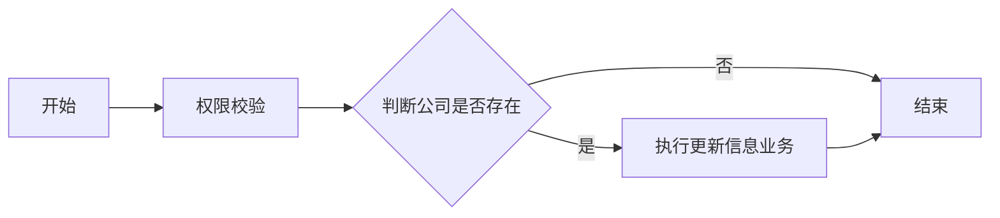
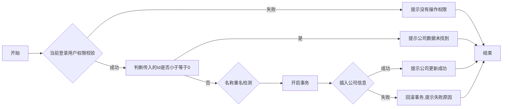

- 更新公司信息 业务流程

```mermaid 
flowchart LR
开始 -->T[权限校验]-->A{判断公司是否存在}
A -->|否| END
A -->|是| C[执行更新信息业务] -->END
END[结束]
```

- 接口逻辑实现

```mermaid 
flowchart LR
开始 -->T{当前登录用户权限校验}
T -->|失败| T0[提示没有操作权限] -->END
T -->|成功| Z[判断传入的Id是否小于等于0]
Z -->|是| Z0[提示公司数据未找到] -->END
Z -->|否| A{名称重名检测} --> B[开启事务] --> D{插入公司信息}
D -->|失败| FAILED
D -->|成功| D1[提示公司更新成功] --> END

END[结束]
FAILED[回滚事务,提示失败原因]--> END
```

---
备注：
- 修改公司信息：只能修改公司名称，负责人及联系电话，备注信息
