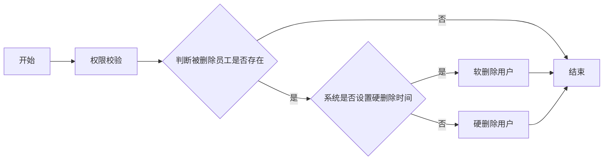
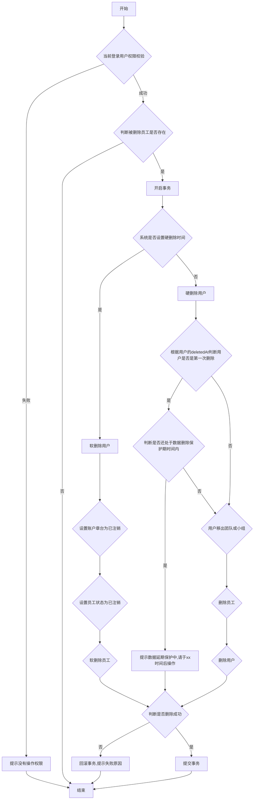

- 删除员工信息 业务流程

```mermaid
flowchart LR
开始 -->T[权限校验] -->A{判断被删除员工是否存在}
A -->|否| END
A -->|是| B{系统是否设置硬删除时间} 
B -->|是| C[软删除用户] -->END
B -->|否| D[硬删除用户] -->END
 
 END[结束]
```

- 逻辑接口实现

```mermaid 
flowchart TB
开始 -->T{当前登录用户权限校验}
T -->|失败| T0[提示没有操作权限] -->END
T -->|成功| A{判断被删除员工是否存在}
A -->|否| END
A -->|是| A0[开启事务] -->B{系统是否设置硬删除时间} 
B -->|是| C[软删除用户] -->C1{设置账户章台为已注销} -->C2{设置员工状态为已注销}
-->C3{软删除员工} -->F{判断是否删除成功} 
F -->|否| FAILED
F -->|是| SUCCESS
B -->|否| D[硬删除用户] -->G{根据用户的deletedAt判断用户是否是第一次删除}
G -->|是| H{判断是否还处于数据删除保护期时间内}
H -->|是| H0[提示数据延期保护中,请于xx时间后操作] -->F
H -->|否| D1
G -->|否| D1{用户移出团队或小组} -->D2{删除员工} -->D3{删除用户} -->F


END[结束]
FAILED[回滚事务,提示失败原因] -->END
SUCCESS[提交事务] -->END
```
