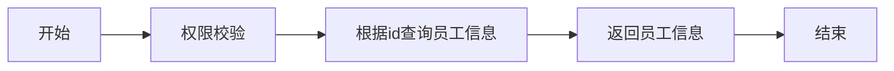
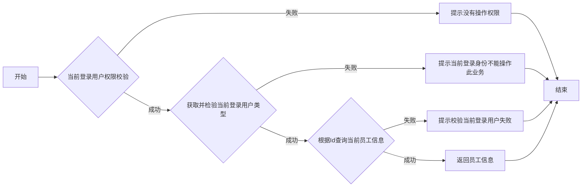

- 获取当前登录员工信息 业务流程

```mermaid
flowchart LR
开始 -->T[权限校验] -->A[根据id查询员工信息] -->B[返回员工信息] -->结束
```

- 接口逻辑实现

```mermaid
flowchart LR
开始 -->T{当前登录用户权限校验}
T -->|失败| T0[提示没有操作权限] -->END
T -->|成功| Z{获取并检验当前登录用户类型}
Z -->|失败| Z0[提示当前登录身份不能操作此业务] -->END
Z -->|成功| A{根据Id查询当前员工信息}
A -->|失败| A0[提示校验当前登录用户失败] -->END
A -->|成功| D[返回员工信息] --> END

END[结束]
```

