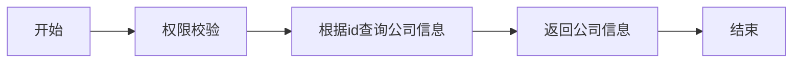
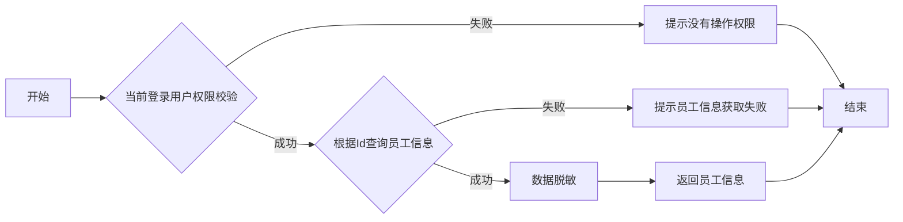

- 根据id获取员工信息 业务流程

```mermaid
flowchart LR
开始 -->T[权限校验] -->A[根据id查询公司信息] -->B[返回公司信息] -->结束
```

- 接口逻辑实现

```mermaid
flowchart LR
开始 -->T{当前登录用户权限校验}
T -->|失败| T0[提示没有操作权限] -->END
T -->|成功| A{根据Id查询员工信息}
A -->|失败| A0[提示员工信息获取失败]-->END
A -->|成功| C[数据脱敏] --> D[返回员工信息] --> END

END[结束]
```
---
备注：
- 脱敏数据: 
    - 员工联系电话号码
    - 最后一次活跃ip
