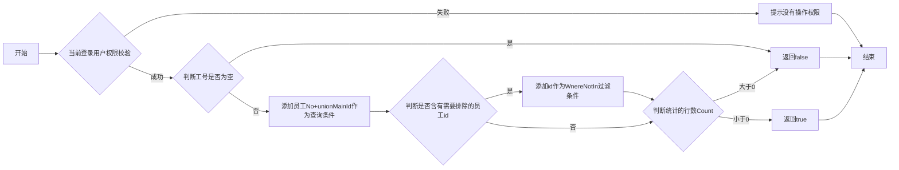

- 判断员工工号是否存在 业务流程

```mermaid
flowchart LR
开始 -->T[权限校验] -->A[添加需要排除的员工id条件] -->B[根据No工号判断员工是否存在] -->C[返回结果] -->结束
```

- 接口逻辑实现

```mermaid
flowchart LR
开始 -->T{当前登录用户权限校验}
T -->|失败| T0[提示没有操作权限] -->END
T -->|成功| Z{判断工号是否为空}
Z -->|是| F[返回false] -->END
Z -->|否| A0[添加员工No+unionMainId作为查询条件] -->A{判断是否含有需要排除的员工id}
A -->|是| B[添加id作为WnereNotIn过滤条件] -->D{判断统计的行数Count}
D -->|大于0| F
D -->|小于0| G[返回true] -->END
A -->|否| D 
END[结束]
```

