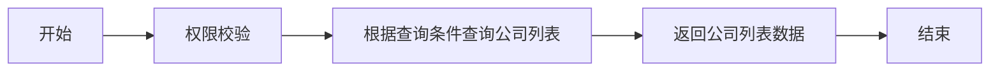
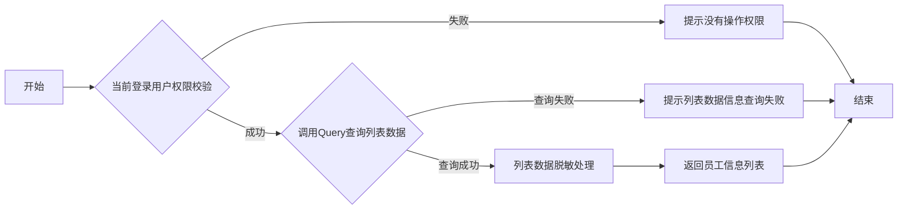

- 查询员工列表 业务流程

```mermaid 
flowchart LR
开始 -->T[权限校验] -->A[根据查询条件查询公司列表] -->B[返回公司列表数据] -->结束
```

- 接口逻辑实现

```mermaid 
flowchart LR
开始 -->T{当前登录用户权限校验}
T -->|失败| T0[提示没有操作权限] -->END
T -->|成功| A{调用Query查询列表数据}
A -->|查询失败| A0[提示列表数据信息查询失败] --> END
A -->|查询成功| B[列表数据脱敏处理] -->C[返回员工信息列表] --> END

END[结束]
```

---
备注：
- 员工脱敏数据: 
    - 员工联系电话号码
    - 最后一次活跃ip
