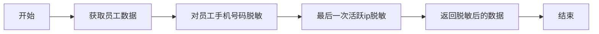
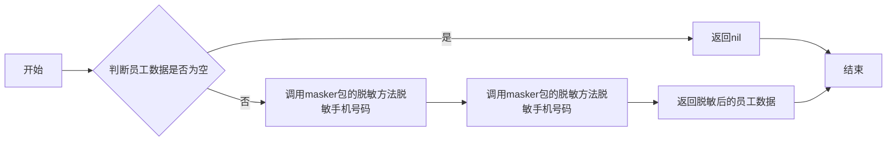

- 员工信息脱敏 业务流程

```mermaid
flowchart LR
开始 -->A[获取员工数据] -->B[对员工手机号码脱敏] --> B1[最后一次活跃ip脱敏] -->C[返回脱敏后的数据] -->结束
```
- 逻辑接口实现

```mermaid
flowchart LR
开始 -->A{判断员工数据是否为空} 
A -->|是| A0[返回nil] -->END
A -->|否| B[调用masker包的脱敏方法脱敏手机号码] -->B1[调用masker包的脱敏方法脱敏手机号码]-->C[返回脱敏后的员工数据] -->END
END[结束]
```

---
备注：
- 脱敏数据: 
    - 员工联系电话号码
    - 最后一次活跃ip
