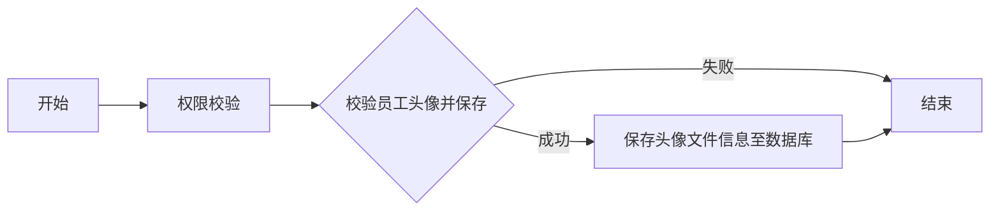
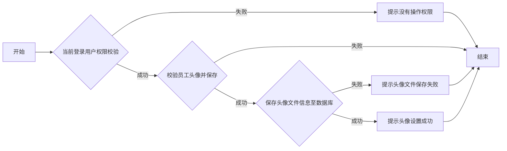

- 设置员工头像 业务流程

```mermaid
flowchart LR
开始 -->T[权限校验] -->A{校验员工头像并保存}
A -->|失败| 结束 
A -->|成功| B[保存头像文件信息至数据库] -->结束
```

```mermaid 
flowchart LR
开始 -->T{当前登录用户权限校验}
T -->|失败| T0[提示没有操作权限] -->END
T -->|成功| A{校验员工头像并保存}
A -->|失败| END
A -->|成功| B{保存头像文件信息至数据库}
B -->|失败| B0[提示头像文件保存失败] -->END
B -->|成功| C[提示头像设置成功] -->END

END[结束]
```
