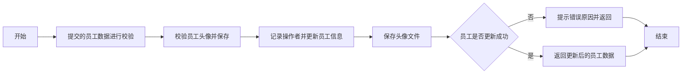
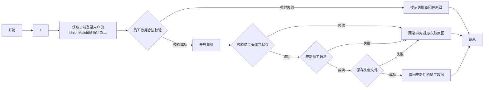

- 更新员工信息 业务流程

```mermaid
flowchart LR
开始 -->A[提交的员工数据进行校验] -->B[校验员工头像并保存] -->C[记录操作者并更新员工信息] -->E[保存头像文件] -->F{员工是否更新成功}
F -->|否| F0[提示错误原因并返回] -->END
F -->|是| G[返回更新后的员工数据] -->END
END[结束]
```

- 接口逻辑实现

```mermaid
flowchart LR
开始 -->T -->B[获取当前登录用户的UnionMainId赋值给员工]
-->C{员工数据合法校验} 
C -->|校验失败| C0[提示失败原因并返回] -->END
C -->|校验成功| D[开启事务] -->E{校验员工头像并保存}
E -->|失败| FAILED
E -->|成功| F{更新员工信息}
F -->|失败| FAILED
F -->|成功| H{保存头像文件}
H -->|失败| FAILED
H -->|成功| I[返回更新后的员工数据] --> END

END[结束]
FAILED[回滚事务,提示失败原因]--> END
```

---
备注：
- 员工数据合法校验：
    - 所属主体不能为空
    - 所属主体校验失败
    - 名称是否已存在
    - 工号不能为空
    - 工号是否已存在

- UnionMainId：主体id