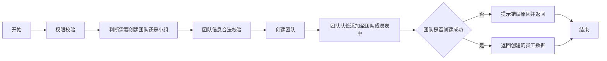
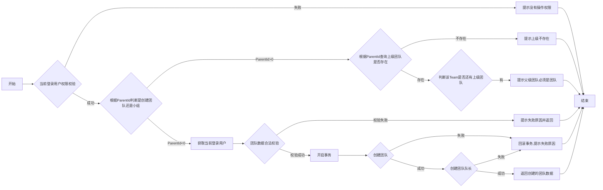

- 创建团队信息 业务流程

```mermaid
flowchart LR
开始 -->T[权限校验] -->A[判断需要创建团队还是小组] -->B[团队信息合法校验] -->C[创建团队]
 -->D[团队队长添加至团队成员表中]  -->F{团队是否创建成功}
F -->|否| F0[提示错误原因并返回] -->END
F -->|是| G[返回创建的员工数据] -->END
END[结束]
```

- 接口逻辑实现

```mermaid
flowchart LR
开始 -->T{当前登录用户权限校验}
T -->|失败| T0[提示没有操作权限] -->END
T -->|成功| A{根据ParentId判断是创建团队还是小组}
A -->|ParentId>0| A1{根据ParentId查询上级团队是否存在}
A1 -->|不存在| A10[提示上级不存在] -->END
A1 -->|存在| A2{判断该Team是否还有上级团队}
A2 -->|有| A20[提示父级团队必须是团队] -->END
A -->|ParentId<0| B[获取当前登录用户]-->C{团队数据合法校验} 
C -->|校验失败| C0[提示失败原因并返回] -->END
C -->|校验成功| D[开启事务] -->E{创建团队}
E -->|失败| FAILED
E -->|成功| F{创建团队队长}
F -->|失败| FAILED
F -->|成功| G[返回创建的团队数据] --> END

END[结束]
FAILED[回滚事务,提示失败原因]--> END
```

---
备注：
- 团队数据合法校验：
    - 团队名称是否已存在
    - 团队管理人信息是否存在
    - 团队队长是否存在

- ParentId：父级团队id