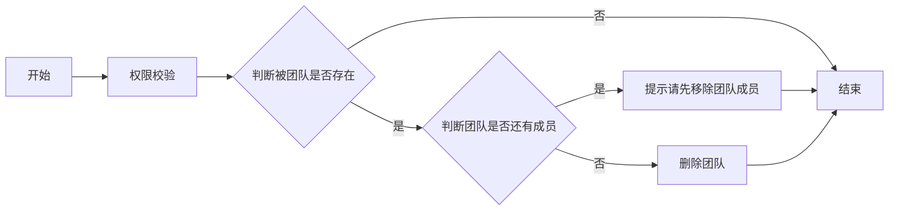
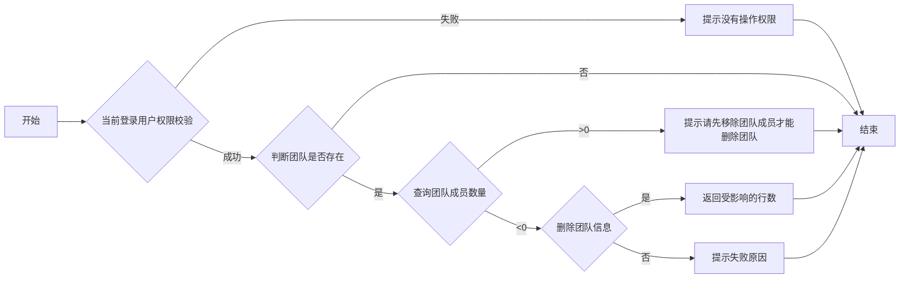

- 删除团队信息 业务流程

```mermaid
flowchart LR
开始 -->T[权限校验] -->A{判断被团队是否存在}
A -->|否| END
A -->|是| B{判断团队是否还有成员} 
B -->|是| C[提示请先移除团队成员] -->END
B -->|否| D[删除团队] -->END
 
 END[结束]
```

- 逻辑接口实现

```mermaid 
flowchart LR
开始 -->T{当前登录用户权限校验}
T -->|失败| T0[提示没有操作权限] -->END
T -->|成功| A{判断团队是否存在}
A -->|否| END
A -->|是| B{查询团队成员数量} 
B -->|>0| C[提示请先移除团队成员才能删除团队] -->END
B -->|<0| E{删除团队信息} 
E -->|否| FAILED
E -->|是| F[返回受影响的行数] -->END


END[结束]
FAILED[提示失败原因] -->END
```
