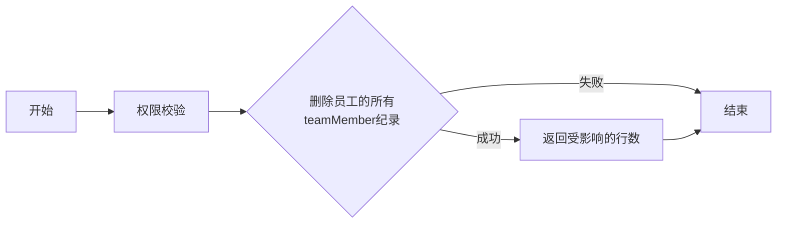
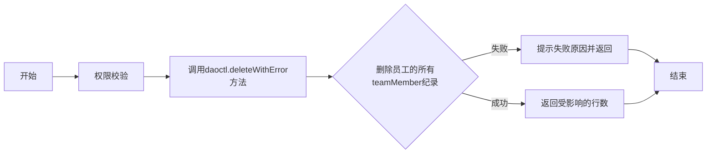

- 删除某个员工的所有团队成员记录 业务流程

```mermaid
flowchart LR
开始 -->T[权限校验] -->A{删除员工的所有teamMember纪录}
A -->|失败| END
A -->|成功| C[返回受影响的行数] -->END
 
 END[结束]
```

- 逻辑接口实现

```mermaid
flowchart LR
开始 -->T[权限校验] -->A[调用daoctl.deleteWithError方法] -->B{删除员工的所有teamMember纪录}
B -->|失败| B0[提示失败原因并返回] -->END
B -->|成功| C[返回受影响的行数] -->END
 
 END[结束]
```