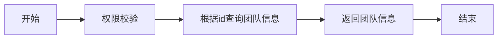
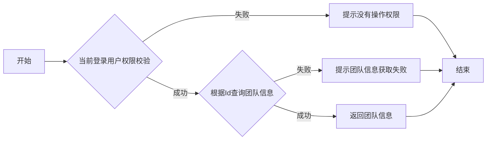

- 根据ID获取公司团队信息 业务流程

```mermaid
flowchart LR
开始 -->T[权限校验] -->A[根据id查询团队信息] -->B[返回团队信息] -->结束
```

- 接口逻辑实现

```mermaid
flowchart LR
开始 -->T{当前登录用户权限校验}
T -->|失败| T0[提示没有操作权限] -->END
T -->|成功| A{根据Id查询团队信息}
A -->|失败| A0[提示团队信息获取失败]-->END
A -->|成功| D[返回团队信息] --> END

END[结束]
```
