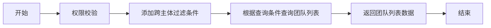
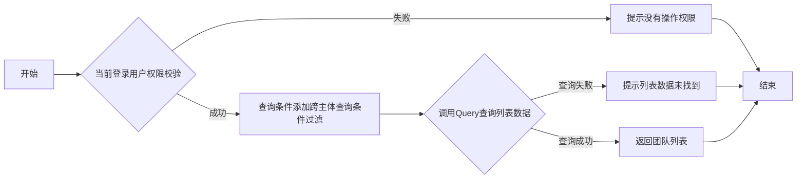

- 查询团队列表 业务流程

```mermaid 
flowchart LR
开始 -->T[权限校验] -->A[添加跨主体过滤条件] -->B[根据查询条件查询团队列表] -->C[返回团队列表数据] -->结束
```

- 接口逻辑实现

```mermaid 
flowchart LR
开始 -->T{当前登录用户权限校验}
T -->|失败| T0[提示没有操作权限] -->END
T -->|成功| A[查询条件添加跨主体查询条件过滤] --> B{调用Query查询列表数据}
B -->|查询失败| B0[提示列表数据未找到] --> END
B -->|查询成功| C[返回团队列表] --> END

END[结束]
```
