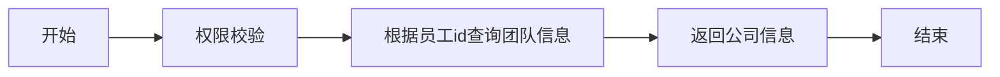
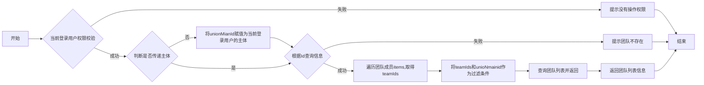

- 根据员工查询团队|列表 业务流程

```mermaid
flowchart LR
开始 -->T[权限校验]  -->A[根据员工id查询团队信息] -->B[返回公司信息] -->结束
```

- 接口逻辑实现

```mermaid
flowchart LR
开始 -->T{当前登录用户权限校验}
T -->|失败| T0[提示没有操作权限] -->END
T -->|成功| A{判断是否传递主体}
A -->|否| A0[将unionMianId赋值为当前登录用户的主体] -->B
A -->|是| B{根据Id查询信息}
B -->|失败| B0[提示团队不存在]-->END
B -->|成功| C[遍历团队成员items,取得teamIds] -->E[将teamIds和unioNmainid作为过滤条件] -->F[查询团队列表并返回] --> D[返回团队列表信息] --> END

END[结束]
```
---
备注：
- 脱敏数据: 
    - 员工联系电话号码
    - 最后一次活跃ip
