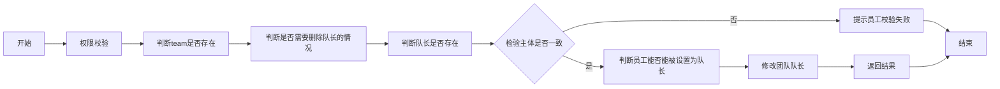
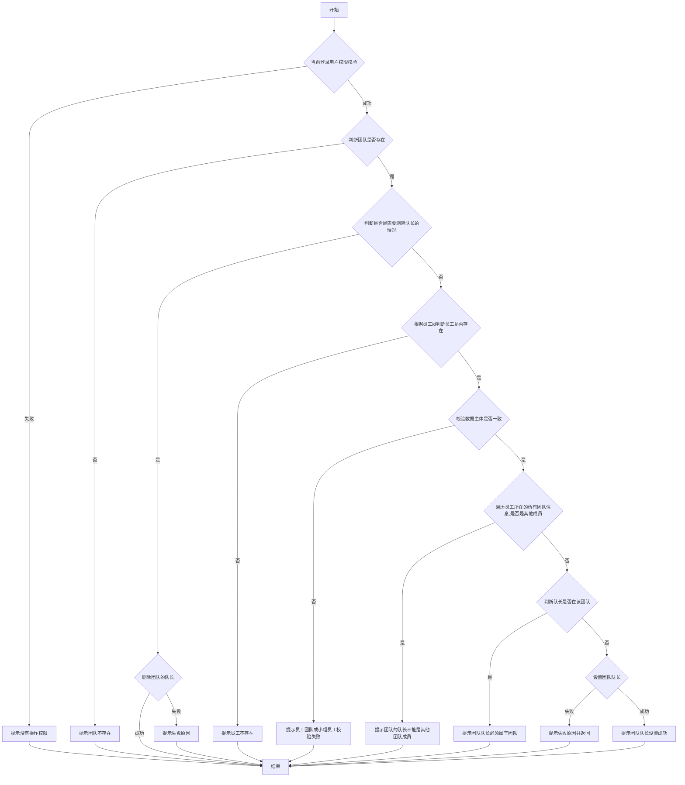

- 设置队长或者组长 业务流程

```mermaid
flowchart LR
开始 -->T[权限校验] -->A[判断team是否存在] -->A1[判断是否需要删除队长的情况] -->B[判断队长是否存在] --> C{检验主体是否一致}
C -->|否| C0[提示员工校验失败] -->结束
C -->|是| C1[判断员工能否能被设置为队长] -->D[修改团队队长] -->E[返回结果]
 -->结束
```

- 逻辑接口实现

```mermaid 
flowchart TB
开始 -->T{当前登录用户权限校验}
T -->|失败| T0[提示没有操作权限] -->END
T -->|成功| A{判断团队是否存在}
A -->|否| A0[提示团队不存在] -->END
A -->|是| B{判断是否是需要删除队长的情况}
B -->|是| B1{删除团队的队长}
B1 -->|成功| END
B1 -->|失败| B10[提示失败原因] -->END
B -->|否| C{根据员工id判断员工是否存在}
C -->|否| C0[提示员工不存在] -->END
C -->|是| D{校验数据主体是否一致}
D -->|否| D0[提示员工团队或小组员工校验失败] -->END
D -->|是| F{遍历员工所在的所有团队信息,是否是其他成员}
F -->|是| F0[提示团队的队长不能是其他团队成员] -->END
F -->|否| F1{判断队长是否在该团队}
F1 -->|是| F10[提示团队队长必须属于团队] -->END
F1 -->|否| F2{设置团队队长}
F2 -->|失败| F20[提示失败原因并返回] -->END
F2 -->|成功| G[提示团队队长设置成功] -->END

END[结束]
```

---
注意：
- 需要删除队长的情况：employeeId为0,并且teamID不为0 

团队|小组成员限制：
- 团队成员不能是别的团队的成员 
- 小组成员可以是别的团队的成员 
- 团队队长必须是团队里面的人
- 团队管理者可以不是团队里面的人

- 小组的队长可以不是小组和团队里面的人

