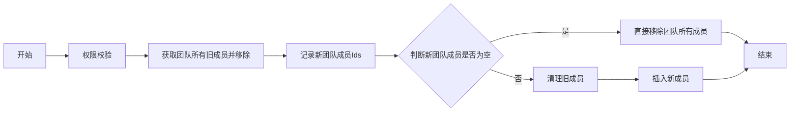
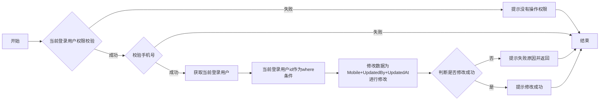

- 设置团队或小组成员 业务流程

```mermaid
flowchart LR
开始 -->T[权限校验] -->A[获取团队所有旧成员并移除] -->B[记录新团队成员Ids] --> C{判断新团队成员是否为空}
C -->|是| C0[直接移除团队所有成员] -->结束
C -->|否| D[清理旧成员] -->E[插入新成员]
 -->结束
```

- 逻辑接口实现(需补充)

```mermaid 
flowchart LR
开始 -->T{当前登录用户权限校验}
T -->|失败| T0[提示没有操作权限] -->END
T -->|成功| A{校验手机号}
A -->|失败| END
A -->|成功| B[获取当前登录用户] -->C[当前登录用户id作为where条件] -->D[修改数据为Mobile+UpdatedBy+UpdatedAt进行修改] -->F{判断是否修改成功}
F -->|否| F0[提示失败原因并返回] -->END
F -->|是| G[提示修改成功] -->END

END[结束]
```
