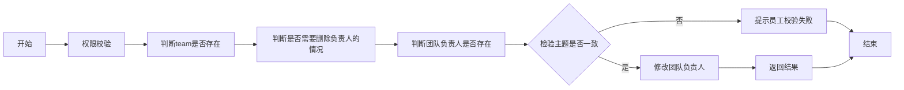
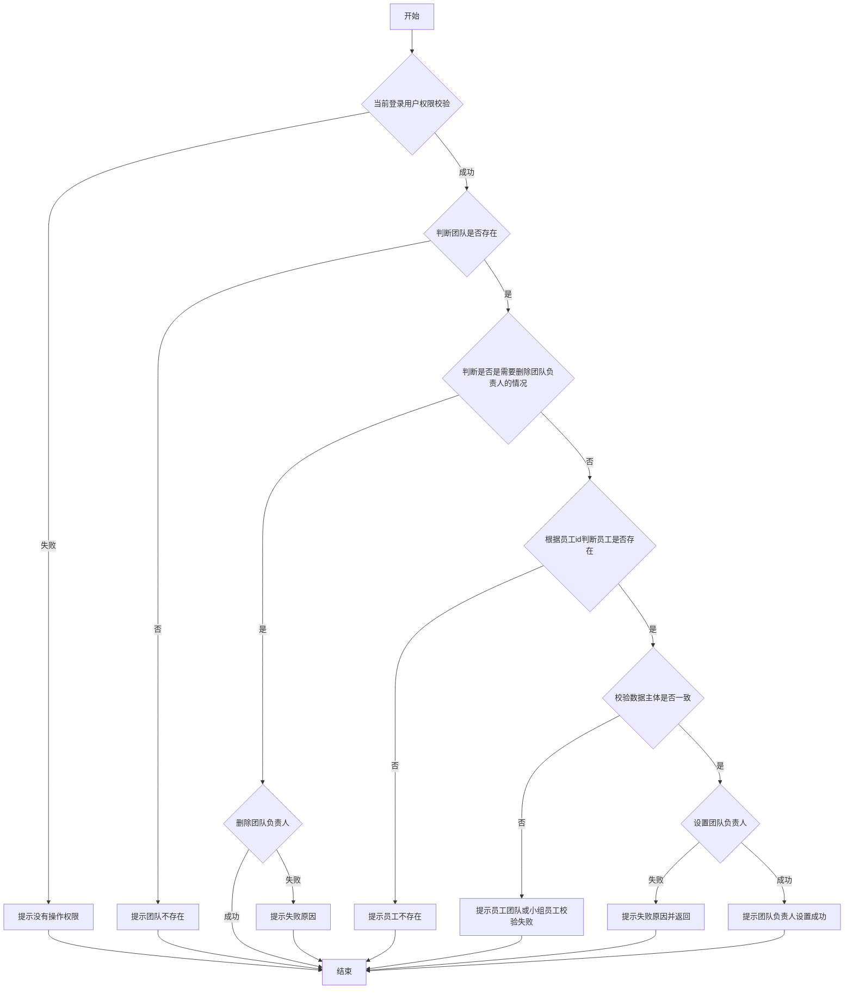

- 设置团队或小组的负责人 业务流程

```mermaid
flowchart LR
开始 -->T[权限校验] -->A[判断team是否存在] -->A1[判断是否需要删除负责人的情况] -->B[判断团队负责人是否存在] --> C{检验主题是否一致}
C -->|否| C0[提示员工校验失败] -->结束
C -->|是| D[修改团队负责人] -->E[返回结果]
 -->结束
```

- 逻辑接口实现

```mermaid 
flowchart TB
开始 -->T{当前登录用户权限校验}
T -->|失败| T0[提示没有操作权限] -->END
T -->|成功| A{判断团队是否存在}
A -->|否| A0[提示团队不存在] -->END
A -->|是| B{判断是否是需要删除团队负责人的情况}
B -->|是| B1{删除团队负责人}
B1 -->|成功| END
B1 -->|失败| B10[提示失败原因] -->END
B -->|否| C{根据员工id判断员工是否存在}
C -->|否| C0[提示员工不存在] -->END
C -->|是| D{校验数据主体是否一致}
D -->|否| D0[提示员工团队或小组员工校验失败] -->END
D -->|是| F{设置团队负责人}
F -->|失败| F0[提示失败原因并返回] -->END
F -->|成功| G[提示团队负责人设置成功] -->END

END[结束]
```
