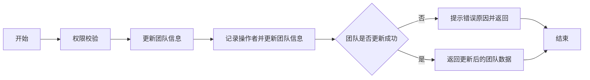
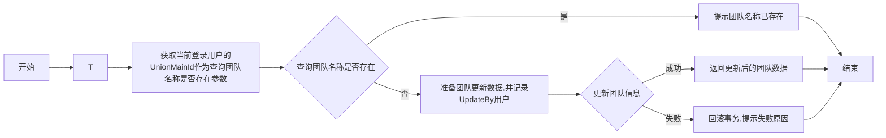

- 更新团队信息 业务流程

```mermaid
flowchart LR
开始 -->T[权限校验]-->A[更新团队信息] -->B[记录操作者并更新团队信息] -->E{团队是否更新成功}
E -->|否| E0[提示错误原因并返回] -->END
E -->|是| G[返回更新后的团队数据] -->END
END[结束]
```

- 接口逻辑实现

```mermaid
flowchart LR
开始 -->T -->B[获取当前登录用户的UnionMainId作为查询团队名称是否存在参数]
-->C{查询团队名称是否存在} 
C -->|是| C0[提示团队名称已存在] -->END
C -->|否| D[准备团队更新数据,并记录UpdateBy用户] -->E{更新团队信息}
E -->|失败| FAILED
E -->|成功| F[返回更新后的团队数据] --> END

END[结束]
FAILED[回滚事务,提示失败原因]--> END
```

---
备注：团队信息只能修改名称和备注信息