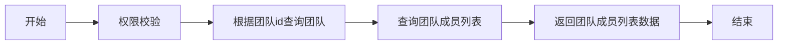
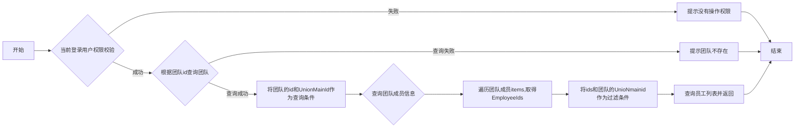

- 获取团队员工列表 业务流程

```mermaid 
flowchart LR
开始 -->T[权限校验] -->A[根据团队id查询团队] -->B[查询团队成员列表] -->C[返回团队成员列表数据] -->结束
```

- 接口逻辑实现

```mermaid 
flowchart LR
开始 -->T{当前登录用户权限校验}
T -->|失败| T0[提示没有操作权限] -->END
T -->|成功| A{根据团队id查询团队}
A -->|查询失败| A0[提示团队不存在] --> END
A -->|查询成功| B[将团队的id和UnionMainId作为查询条件]-->C{查询团队成员信息} -->D[遍历团队成员items,取得EmployeeIds] -->E[将ids和团队的UnioNmainid作为过滤条件] -->F[查询员工列表并返回] --> END

END[结束]
```

---
备注：
- ids就是员工们的id